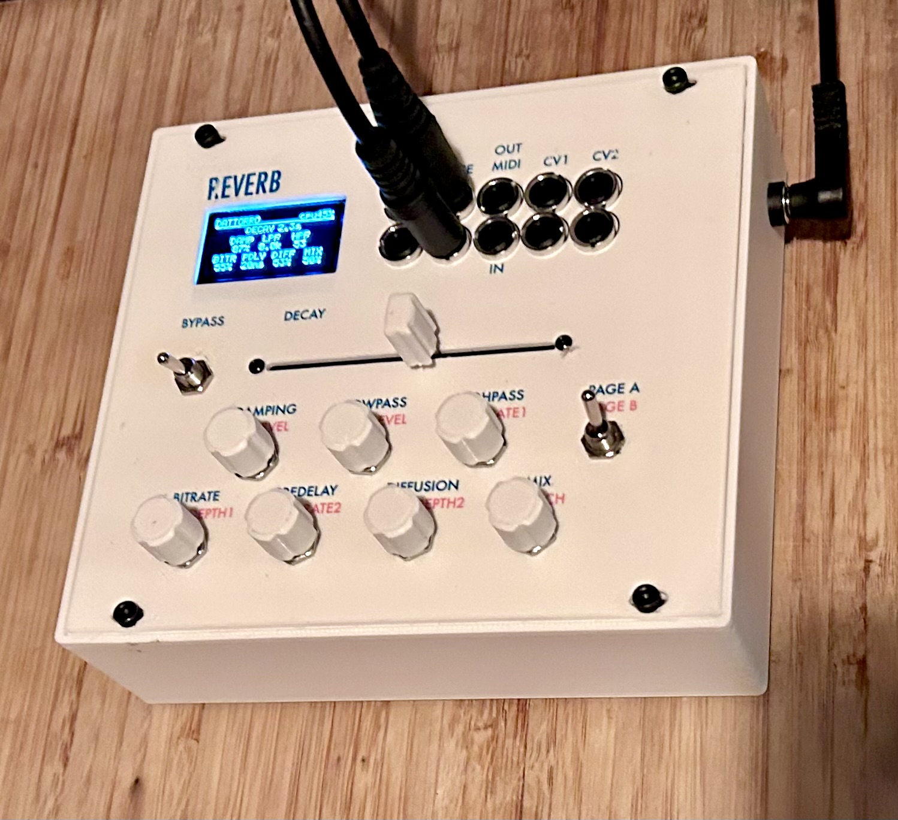

# P.VERB

A Dattorro plate reverb as a Eurorack module, running on the wonderful AMYboard hardware (based on ESP32-S3 with audio codecs, CV and more).

Stereo in/out, eight reverb parameters plus modulation, full bidirectional MIDI,
and an OLED laid out to mirror the front panel. The DSP is the sketch itself —
no reverb library, no DAW, no host computer.





---

## What it is

A digital plate reverb built on Jon Dattorro's 1997 figure-8 topology, ported to
an ESP32-S3 and packaged as a self-contained Eurorack module. It runs at 44.1 kHz
with a 256-sample block, using around 40 % of the available realtime budget.

The reverb is genuinely the Dattorro plate — the original delay lengths, scaled
from his 29761 Hz reference to 44100 Hz — with a few additions that make it a
performance instrument rather than a faithful reproduction:

- **A bitcrusher at the front of the chain**, before diffusion, so quantization
  and decimation artifacts smear through the tank instead of sitting on top.
- **Two independent tank LFOs** at deliberately unrelated phases, so the
  modulation never settles into a periodic beat.
- **A freeze at full decay travel** — the tank sustains indefinitely while still
  accepting input, so it layers rather than holding a snapshot.

Everything is controlled from the panel or over MIDI. Knob and CC are fully
interchangeable: both paths run through the same mapping law, so a CC value and
the equivalent knob position produce an identical sound.

---

## Hardware

| | |
|---|---|
| **Host** | AMYboard (ESP32-S3), AMY used for audio I/O only |
| **Audio** | Stereo in/out — digital and line jacks |
| **Display** | SH1106 128×64 OLED, library-free driver |
| **Controls** | Option 1: M5stack 8angle unit: 8 pots and one toggle - Option 2: Custom 8angle Emulator: 1 slide pot, 7 rotaries, 2 toggles |
| **MIDI** | TRS in and out, differential drive |
| **Panel** | 3D-printed, two-colour printed decal |
| **CV** | Two jacks provisioned, no firmware yet |

Theres two options for the control panel:
Option 1. M5stack 8angle unit (stock part): simply works. You have no hardware bypass though because it only has one toggle which is used for page switching on the UI. 

Option 2. A custom control surface (I²C peripheral) based on the STM32F411CE "Black Pill"
running firmware that emulates the M5Stack 8Angle unit register-for-register,
with an extra toggle added at a spare register. Any host using the stock 8Angle
driver works against it unchanged. Its firmware is in [`control-surface/`](control-surface/).
A bus diagnostic for debugging the I²C link is in > [`tools/`](tools/).

### Known caveat for the Custom control surface — NeoPixels

The emulator drives 9 SK6812/WS2812 LEDs (8 pots + switch), but **the per-frame
`strip.show()` call is commented out** in the shipped firmware. Calling it too
rapidly was hanging the I²C bus. Only the one-time `begin()`/`show()` at boot
runs, so the LEDs initialize but don't update live.

This is safe as-is for P.VERB, which doesn't use the LEDs at all. It's also
safe to reuse in other projects — just know the LEDs won't animate until
someone works out a timing-safe way to call `show()` without colliding with a
host I²C read/write.

---

## Signal chain

```
in → bitcrusher → predelay → LPF → HPF → 4× input diffusion allpass
   → figure-8 tank (2 modulated allpasses + delay + damping per side,
                    cross-coupled feedback)
   → fixed output taps × 0.6 → mix
```

Delay buffers are allocated from internal SRAM first and fall back to PSRAM,
since the tank makes roughly 46 buffer accesses per sample and PSRAM latency
shows up directly in the CPU budget.

---

## Controls

Two pages, selected by a physical toggle — the switch position *is* the page,
so there is no software state to get out of sync.

**Page A** — the reverb: decay (on the slide pot), damping, lowpass, highpass,
bitrate, predelay, diffusion, mix.

**Page B** — modulation and levels: input gain, output gain, two LFO rates, two
LFO depths, MIDI channel.

The OLED mirrors the panel geometry: the three top knobs appear on the screen's
top row, the four bottom knobs on its bottom row, with the slide pot's value on
its own line above. Values are numeric with real units — `2.4s`, `4.8k`, `62ms` —
rather than bar graphs, since a pot's own position is already the analog
indicator.

Full operating detail is in [the manual](docs/P.VERB_Manual.pdf).

---

## MIDI

One CC per parameter, 14 in total, in the undefined range 102–115, plus CC 116
for bypass. Both directions work; every controller has been verified on hardware.

Three design decisions worth noting:

**Ownership is last-writer-wins, per parameter.** A CC takes a parameter; moving
the physical knob takes it back. Each of the 14 tracks its owner independently,
so you can automate one parameter from a DAW while riding another by hand. There
is no pickup threshold on the takeback — a deliberate trade of automation safety
for immediacy.

**Transmitted values are raw knob position, not the mapped value.** The receiver
re-applies the same mapping law on the way back in, so a DAW round-trips a knob
move to precisely the original sound with no drift through the parameter law.

**MIDI-owned parameters don't transmit**, which is what stops a feedback loop
when a DAW is both sending and recording.

MIDI channel deliberately has no CC — changing the receive channel over the
channel you're listening on is a footgun.

---

## Persistence

Modulation parameters and MIDI channel are stored in NVS, written about a second
after the last change to protect flash endurance. Four named preset slots hold
modulation settings, saved and recalled over the serial console.

Page A is deliberately *not* persisted — it follows its knobs at power-up, so the
unit always comes back sounding like the panel looks.

---

## Repository layout

```
P.VERB/
├── firmware/
│   └── Pverb_DattorroReverb_AMYboard/
│       ├── Pverb_DattorroReverb_AMYboard.ino   # reverb firmware (host, ESP32-S3)
│       └── eltro_font5x7.h                     # 5×7 font for the OLED driver
├── control-surface/
│   └── M5_8Angle_Emulator/
│       └── M5_8Angle_Emulator.ino              # 8Angle-compatible I2C peripheral (STM32F411CE)
├── tools/
│   └── I2C_8Angle_Diag/
│       └── I2C_8Angle_Diag.ino                 # standalone I2C bus diagnostic (host, ESP32-S3)
├── docs/
│   ├── P.VERB_Manual.pdf                       # operating manual, full MIDI implementation
│   └── images/
│       ├── panel.png
│       ├── out_all.png
│       ├── out_pageA.png
│       └── out_pageB.png
├── LICENSE
└── README.md
```

## Building

**Reverb firmware:** Arduino IDE with the ESP32-S3 board package and the
AMY-Arduino library. Open
`firmware/Pverb_DattorroReverb_AMYboard/Pverb_DattorroReverb_AMYboard.ino` —
the `.ino` and the font header need to stay in the same folder, which is why
they're laid out that way here.

**Control-surface firmware:** Arduino IDE with the STM32duino core, board
"Generic STM32F4 series" → "BlackPill F411CE". Open
`control-surface/M5_8Angle_Emulator/M5_8Angle_Emulator.ino` and flash the
Black Pill directly (see [Known caveat — NeoPixels](#known-caveat--neopixels)
above before wiring up the LEDs).

One build-time choice: `HAS_BYPASS_SWITCH` should be `1` for the custom emulator
(which has the second toggle) and `0` for a stock M5 8Angle. This is a compile
flag rather than runtime detection — the stock unit aliases the bypass register
onto the page-select register, so a runtime probe can't tell them apart.

---

## Tools

**`tools/I2C_8Angle_Diag/`** — a standalone diagnostic sketch for the AMYboard
host, independent of the reverb code. It runs a bus scan, a bare connect probe,
a version-register read, and a few pot reads, each reported PASS/FAIL, to turn
"the control surface doesn't work" into "this specific transaction fails."
Useful for bringing up either a stock M5 8Angle or the custom emulator on a new
board, or for isolating a flaky I²C link without wading through the full reverb
sketch.

---

## Status

Complete and working. DSP, both control pages, OLED, persistence, preset bank,
serial console and MIDI in/out are all verified on hardware.

The two CV jacks are wired but have no firmware; the intended mapping was CV1 to
decay and CV2 to mix, deferred because there's no free control for scale and
offset trim.

## Credits

The reverb topology is from Jon Dattorro, *Effect Design Part 1: Reverberator and
Other Filters* (JAES, 1997). Hardware bring-up patterns — the two-page UI, the
library-free SH1106 driver, and the differential MIDI output — come from an
earlier build on the same board.

## License

See [LICENSE](LICENSE).
